= Vulnerability Management
:toc:
:sectnums:
:icons: font

== Module Goals

* Understand reports in the Vulnerability Management Dashboard
* Set and manage risk acceptance workflows 
* Create a simple report to email to stakeholders

TIP: The locations and size of your panels may vary depending on your screen size and zoom.

== Introduction to Vulnerability Management in RHACS

Vulnerability management protects the software supply chain by preventing known vulnerabilities from being used as entry points. In this lab, you’ll explore Red Hat® Advanced Cluster Security's vulnerability management features, including reports on widespread or recent vulnerabilities and the security of container images in OpenShift. More important than fixing individual vulnerabilities is maintaining an ongoing process to keep container images updated and prevent the promotion of vulnerable images.

== Definition Review

=== CVE

A *CVE* is a publicly disclosed vulnerability with a unique ID (e.g. `CVE-2024-1234`), description, and optional CVSS score. See link:https://www.cve.org/[MITRE^].

=== CVSS

*CVSS* scores severity from 0.1 (low) to 10.0 (critical): Low 0.1–3.9, Medium 4.0–6.9, High 7.0–8.9, Critical 9.0–10.0. See link:https://nvd.nist.gov/vuln-metrics/cvss[NIST^].

=== Red Hat Security Advisory (RHSA)

*RHSA* advisories notify you of vulnerabilities in Red Hat products with severity, affected products, and patch links. See link:https://access.redhat.com/articles/explaining_redhat_errata[Red Hat errata guide^].

== Vulnerability Management in RHACS

RHACS categorizes vulnerabilities by workload, platform, and node so you know which team owns remediation. Focus on process—keeping images updated and blocking vulnerable promotions—not fixing every CVE in isolation.

=== Vulnerability Management - Results

IMPORTANT: CVEs and numbers will vary due to the updating of vulnerability feeds. 

Let's start by looking at the vulnerability results of those applications that we deployed in the first module. 

> Go to the Vulnerability Management -> Results tab

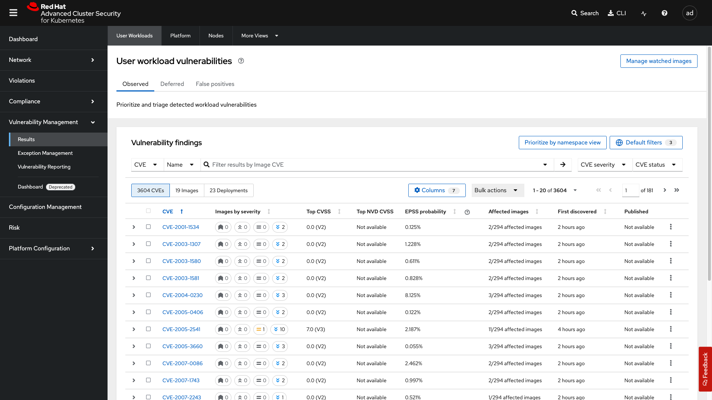

The Results dashboard will show the results of all of the vulnerabilities on the system to help you analyze risk. Let's start in the *User Workloads* tab and find the frontend application.

*Procedure*

. Click the *first dropdown* and select *Namespace*.
. Click the *second dropdown* and select *name*.
. Then, type *patient-portal* to filter for your container image.

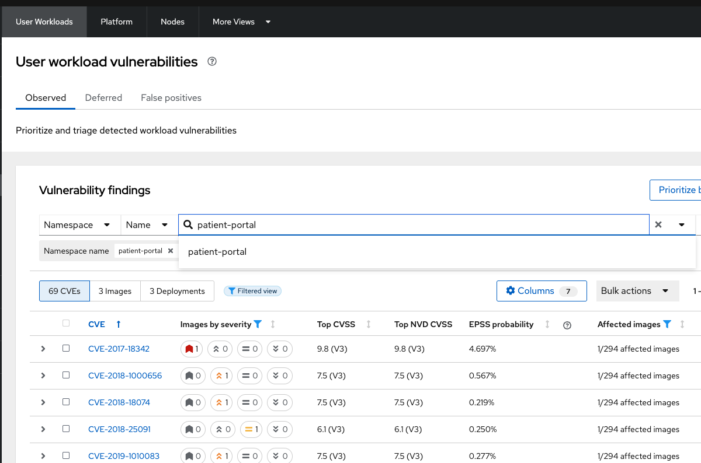

NOTE: You will notice that an extra filter (Namespace name "patient-portal") was added to the default filters, showing only the application that the "Developer" built in the Quay module.

[start=4]
. Click the *3 images* button

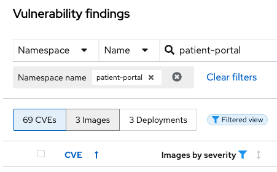

[start=5]
. Next, click on your image. The *quayadmin/frontend:0.1* image.

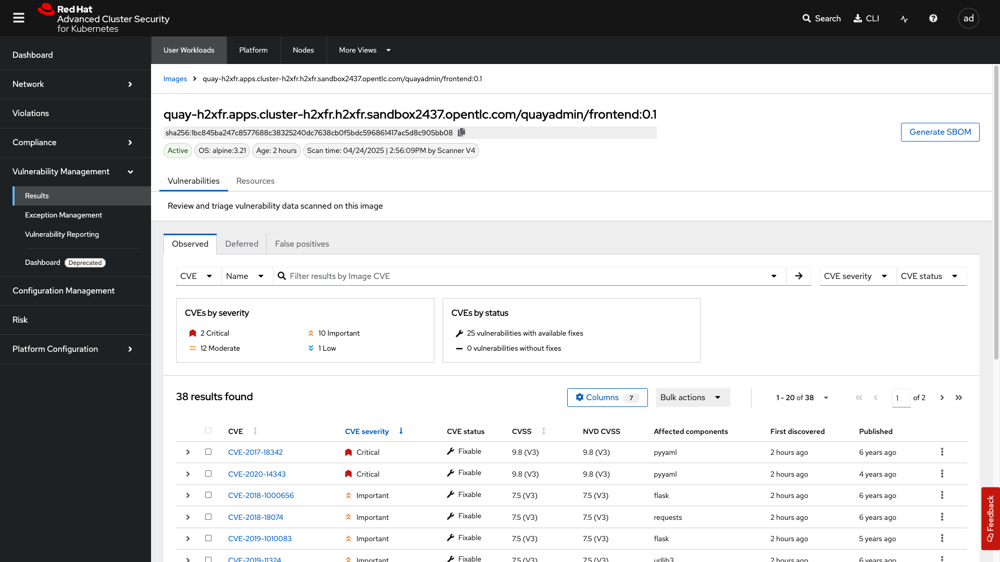

Here you will see all of the vulnerabilities that the "developers" introduced into the environment from module 0, the setup module. 

====
Since CVE-2017-18342 & CVE-2020-14343 both are critical and are specific to the PyYAML package, this package is a high-impact fix for the developers to focus on. 
====

NOTE: Container OS age and the age of its components are a massive correlating factor to the number of vulnerabilities present. Speed is security when it comes to containers. 

[start=6]
. Click the *CVE-2020-14343* blue link.

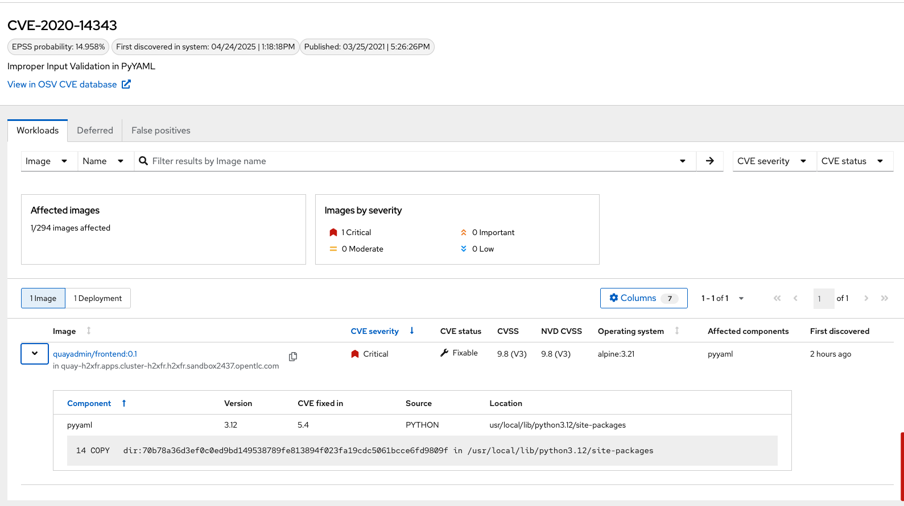

If you're focused on a specific vulnerability, it's very helpful to see all the components it affects. With this dashboard, you can see that our response to this vulnerability needs to be targeted. You should reach out directly to the development team that needs that PyYAML package.

IMPORTANT: As a security team, our next step is to inform the development team about these vulnerabilities. 

Being able to view individual deployments and their images is essential. With multiple clusters and thousands of vulnerabilities, you'll have the same workloads spread across different clusters, and you'll need to dive deep into each deployment.

> Go back to the Vulnerability Management -> Results tab

[start=7]
. Click the *first dropdown* and select *CVE*.
. Click the *second dropdown* and select *name*.
. Then, type *CVE-2021-44228* to filter for the log4shell vulnerability.

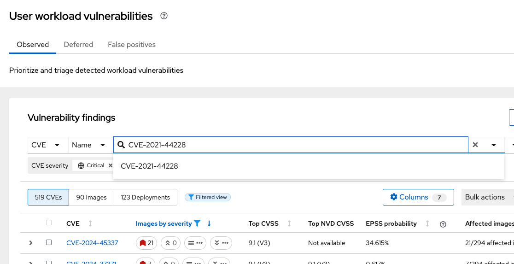

> Take a look at the results

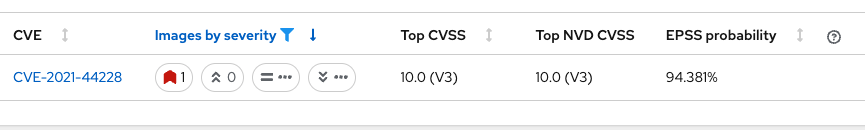

TIP: You should see a single CVE, image, and deployment are affected. There's a CVSS score of 10.0 (Yikes!), an NVD CVSS score of 10 (Double yikes!), and an EPSS score around 95%.

TIP: EPSS is a percentage that shows the likelihood of exploitability.

While we are focusing on the log4shell vulnerability, it is extremely useful to be able to see all of the components affected by that vulnerability. 

[start=10]
. Select the "1 Deployment" button

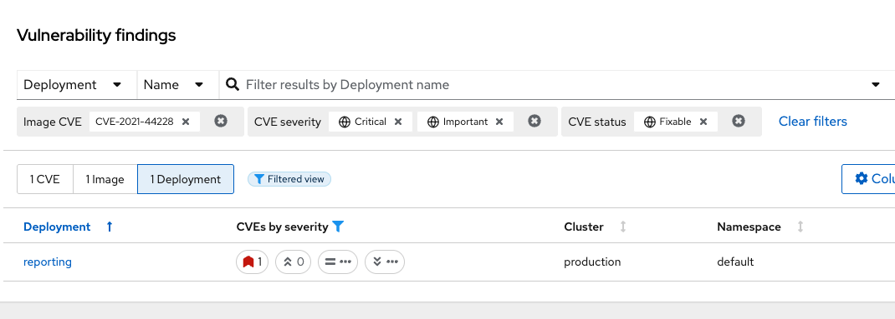

How many deployments are impacted? How many images? What would your response be if you had 10+ images with the log4shell vulnerability vs. 1?

=== Platform CVEs

The platform CVEs page provides information about vulnerabilities in clusters within your system. This refers to OpenShift core services and layered products. The goal is to help you understand responsibility and determine the impact.

Let's go through a simple use case to demonstrate.

*Procedure*

. Click Vulnerability Management → Results → Platform tab.

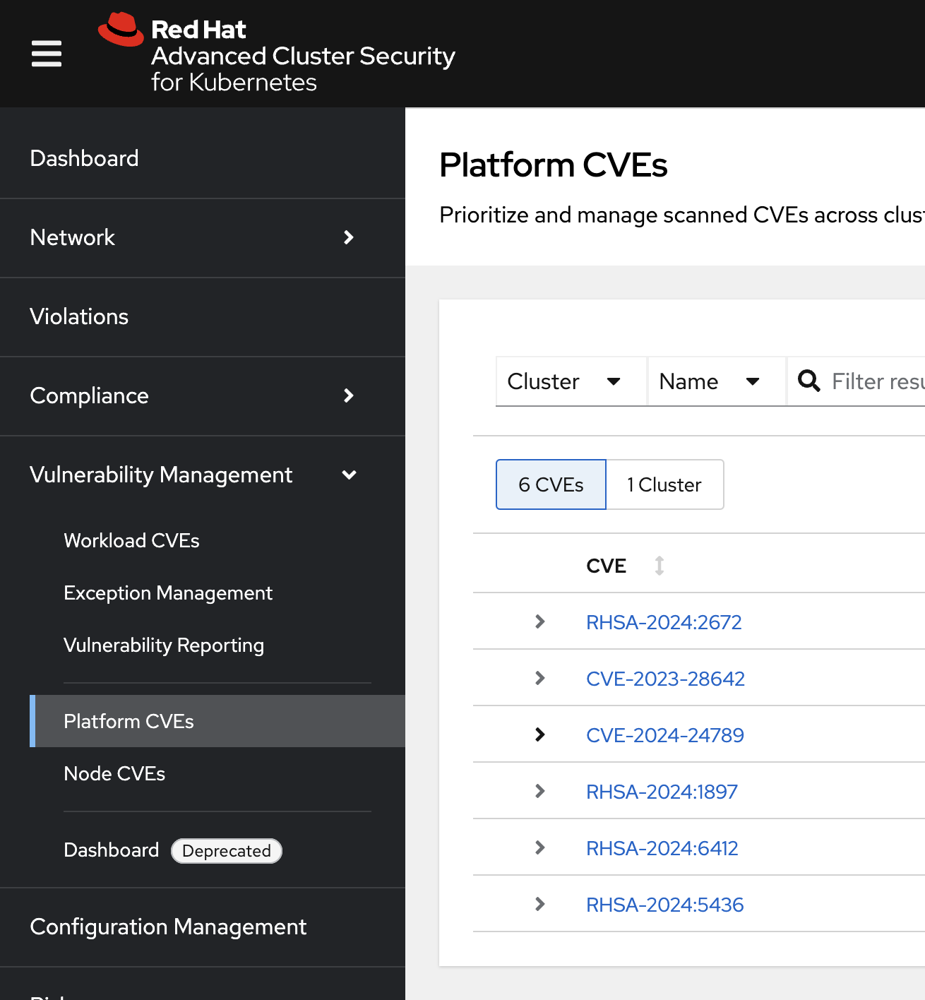

TIP: Filter by *Cluster* name, *CVE* name, or *CVSS* severity. Clear filters to return to default results.

[start=2]
. Search by *Cluster → Platform Type → OPENSHIFT4_CLUSTER*

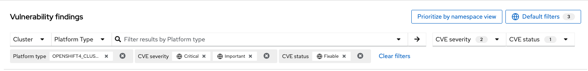

[start=3]
. Click on *CVE-2025-21613* vulnerability

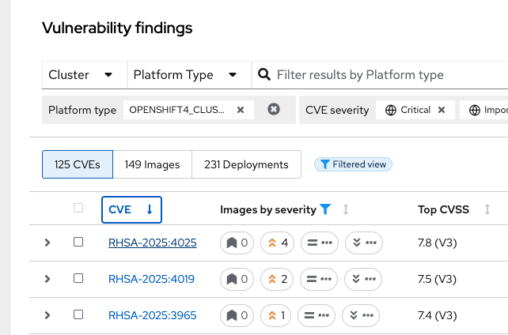

====
Information on scoring and the RHSA response is available. Also note the impacted operators.
====

> How would you address this issue?

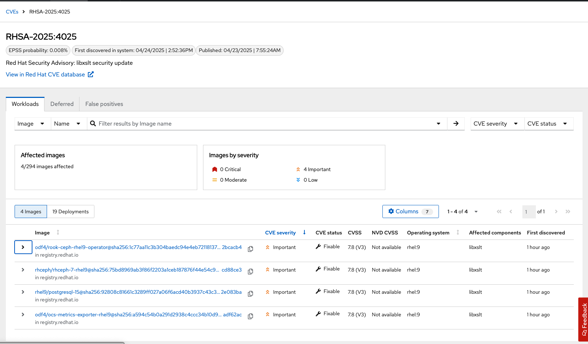

[start=3]
. Click the "*View in Red Hat CVE database*"

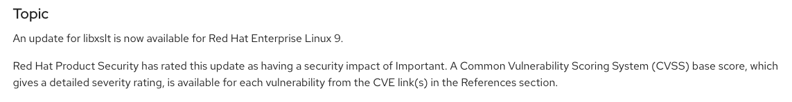

NOTE: Being able to quickly understand the difference between what is your responsibility to fix and what is Red Hat's responsibility is one way RHACS is making vulnerability management easier for our users.

How would you implement this fix to the system?

=== Node CVEs

You can identify vulnerabilities in your nodes by using RHACS. The same logic that applied to the *Platform CVEs* applies here. 

*Procedure*

. Click Vulnerability Management → Results → Platform tab.

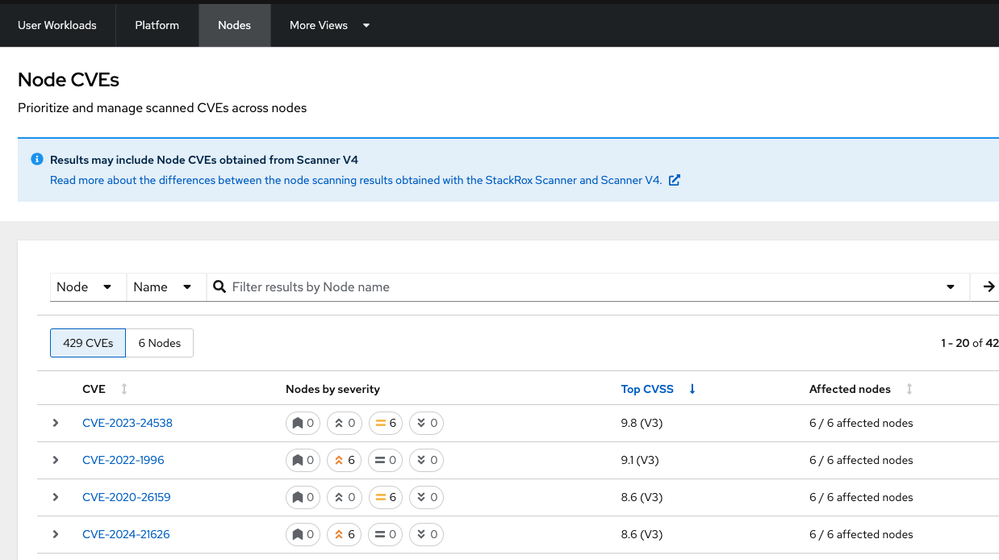

. Find and review the vulnerability we previously looked at RHSA-2025:4025

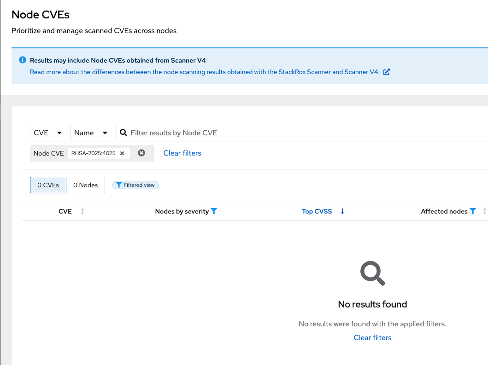

The libxslt package contains this vulnerability but cannot be found on the node. It can be found in the platform vulnerabilities.

What does this tell you? Does it change your response to the issue?

=== More Views

For the sake of time, we will not review all of the extra dashboards, but their functionality is extremely important. 

image::02-moreviews-00.png[link=self, window=blank, width=100%]

*All Vulnerable Images*

This tab shows ALL vulnerability results in a single dashboard. 

*Inactive Images Only*

Findings for watched images and images not currently deployed as workloads based on your image retention settings.

*Images Without CVEs*

Images and workloads without observed CVEs (results might include false negatives due to scanner limitations, such as unsupported operating systems).

NOTE: Some image formats are not supported by RHACS or are too old to have accurate information. It's critical that RHACS points these anomalies out. 

*Kubernetes Components*

RHACS tries to show vulnerabilities for OpenShift, AKS, EKS, and GKE here. However, certain providers do not disclose vulnerabilities associated with their platforms. 

== Vulnerability Reporting

Create a vulnerability report for the *frontend* deployment to notify your developer team.

*Procedure*

. Start by clicking on the *Vulnerability Management → Vulnerability Reporting* tab 

image::02-vr-00.png[link=self, window=blank, width=100%]

[start=2]
. Click the *Create report* button.

image::02-vr-01.png[link=self, window=blank, width=100%]

You will see that creating a report is a three-step process: configure parameters, delivery destination, and review.

The configurable parameters include report name, CVE severity/status, image type, discovery date, and report scope.

[start=3]
. Fill out the information with the following updates:

* Report Name

[source,bash,subs="+macros,+attributes",role=execute]
----
frontend-vuln-report
----

* Report Description (optional)
* CVE severity 
** Critical & Important
* CVE status
** Fixable & Unfixable
* Image type
** Deployed & Watched images
* CVEs discovered since (with a date)
** All time
* Optional columns
** Check NVD and EPSS Scores

. When you are done, select the *Select a collection* dropdown
. Click *Create Collection*

NOTE: The collection scope is where you are going to target the frontend application.

image::02-vr-02.png[link=self, window=blank, width=100%]

[start=6]
. Give your collection the name
[source,bash,subs="+macros,+attributes",role=execute]
----
frontend-collection
----

[start=7]
. Click the deployment dropdown and select "Deployments with names matching," then "Exact value of," and type "*frontend*"

image::02-vr-04.png[link=self, window=blank, width=100%]

TIP: You can create collection rules by deployment, namespace, and cluster. The collections are set up this way so that you can easily attach policies, vulnerability reports, and notifications by the logical groupings of your organization. 

[start=8]
. Review the collection
. Scroll to the bottom of the page and click *Save*
. Click *Next* once you are back in the *Configure report parameters* tab

> You WILL NOT set up the email notifier as it's not needed to view results. 

image::02-vr-05.png[link=self, window=blank, width=100%]

[start=11]
. Click *Next* 
. Review your masterpiece and click *Create*

image::https://media1.giphy.com/media/v1.Y2lkPTc5MGI3NjExOWJ0ZWRjZ3g0OTUyOGE5MDVhdDgyZzVhczcwNGdpbWxibzBhejZzMyZlcD12MV9pbnRlcm5hbF9naWZfYnlfaWQmY3Q9Zw/VdiQKDAguhDSi37gn1/giphy.gif[itsalive]

> Let's review the results!

[start=13]
. Click the vertical ellipses on the right side of the UI and click *Generate Download*

image::02-vr-06.png[link=self, window=blank, width=100%]

[start=14]
. Then click the "ready for download" link and review the results!

image::02-vr-07.png[link=self, window=blank, width=100%]

== What Would You Do?

It’s clear that our notification selection and collection process wasn’t the most efficient way to target a single vulnerability.

Before the next module, think about how you’d organize your notifications and collections. Would you use labels or groups? Would you make sure emails are included in the Kubernetes and OpenShift deployment labels to easily reach the right groups?

When sending these communications, keep these questions in mind:

* What schedule would have the greatest impact when communicating with stakeholders?
* Who is the intended audience?
* Should the report focus only on specific severity vulnerabilities?
* Should it only include vulnerabilities that are fixable?

== Security Exercise: ACME Incident Response

After the payment gateway breach, Morgan asked Sarah to assess whether container hardening would have limited exploitability in ACME's Socket.IO workloads.

include::partial$acme-incident-context.adoc[]

=== Scenario

[quote, Morgan, Infosec]
We have a real RCE in `python-socketio`—CVE-2025-61765. Show me what RHACS sees in the vulnerable demo namespace before we talk image hardening.

=== Your task

include::partial$security-exercise-task-intro.adoc[]

.Step 1 — Navigate to Vulnerability Management
[%collapsible]
====
. In RHACS, navigate to *Vulnerability Management* → *Images* or *Workloads*.
====

.Step 2 — Filter to the vulnerable workload
[%collapsible]
====
. Filter to namespace `vulnerable-workload-{workshop_user_suffix}` and deployment `socketio-server`.
====

.Step 3 — Review CVEs on the image
[%collapsible]
====
. Review critical and important CVEs on the image.
====

.Step 4 — Verify pods and discuss hardening
[%collapsible]
====
Verify the vulnerable workload is running:

[source,bash,subs="+macros,+attributes",role=execute]
----
oc get pods -n vulnerable-workload-{workshop_user_suffix}
----

image::fsi-security/vulnerable-pods-running.png[Vulnerable application pods,link=self, window=blank, width=100%]

Discuss with your neighbor: the library still calls `pickle.loads()` on untrusted data. How does a hardened distroless image reduce blast radius even when the CVE is not yet patched?

image::fsi-security/hardened-image.png[Hardened image example,link=self, window=blank, width=100%]
====

=== What you learned

* Vulnerability management identifies exploitable components like outdated `python-socketio`.
* RHACS connects CVE data to running deployments for prioritization during incidents.
* Defense in depth (minimal images without shells) limits weaponization even when vulnerabilities exist.

== Summary

Great job!

On to risk profiling!

image::https://media.giphy.com/media/v1.Y2lkPTc5MGI3NjExcW84bjNhdDZnN3VhbjkwOGdta2s5Yzg5anFscmU0Mm94cmVmcXVjZSZlcD12MV9pbnRlcm5hbF9naWZfYnlfaWQmY3Q9Zw/cEODGfeOYMRxK/giphy.gif[link=self, window=blank, width=100%, class="center"]

== Cleanup

Before moving to the next module, run the lab cleanup script to reset transient resources from this module.

:lab-cleanup-module: 02
include::partial$lab-cleanup.adoc[]
