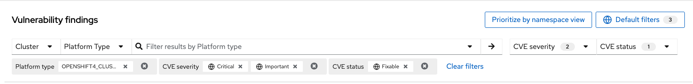
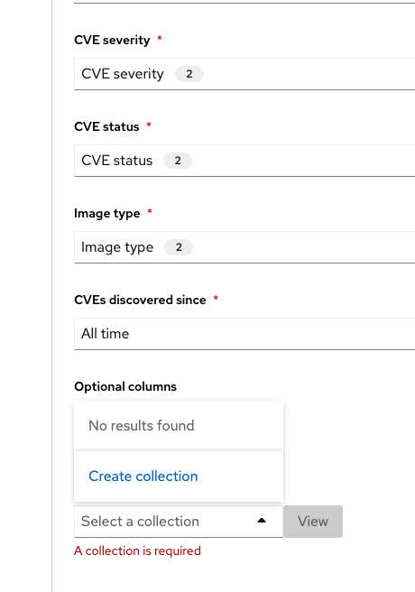
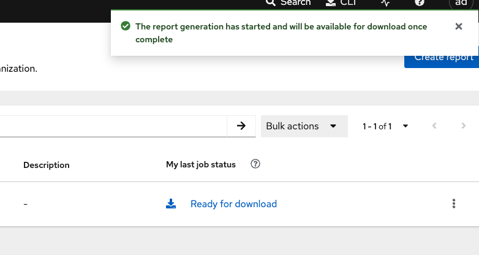

= Vulnerability Management

== Module goals

* Understand reports in the Vulnerability Management Dashboard
* Set and manage risk acceptance workflows 
* Create a simple report to email to stakeholders

TIP: The locations and size of your panels may vary depending on your screen size and zoom.

== Introduction to vulnerability management in RHACS

Vulnerability management protects the software supply chain by preventing known vulnerabilities from being used as entry points. In this lab, you’ll explore Red Hat® Advanced Cluster Security's vulnerability management features, including reports on widespread or recent vulnerabilities and the security of container images in OpenShift. More important than fixing individual vulnerabilities is maintaining an ongoing process to keep container images updated and prevent the promotion of vulnerable images.

== Definition review

You’ll encounter several scores in the following sections. Understanding how vulnerabilities are scored, ranked, and triaged is important.

=== CVE

A Common Vulnerabilities and Exposures (CVE) is a publicly disclosed cybersecurity vulnerability. It includes a unique identifier (e.g., "CVE-2024-1234"), a description, references, creation date, and optional CVSS score. This system helps track vulnerabilities across software and hardware. Learn more at the MITRE website.

Find out more at the link:https://www.cve.org/[MITRE website^].

=== CVSS

The Common Vulnerability Scoring System (CVSS) is a framework for assessing vulnerability severity. It includes:

* Base Metrics: Constant characteristics of a vulnerability.
* Temporal Metrics: Characteristics that change over time.
* Environmental Metrics: Characteristics unique to the user's environment.

CVSS scores range from 0.1 (low) to 10.0 (critical). While it helps assess vulnerability risk, it may lack context sensitivity and be prone to misinterpretation. Learn more at the NIST website.

The CVSS score is computed using a formula that combines these metrics, giving more weight to the base metrics. Temporal and environmental metrics adjust the base score to reflect the current threat landscape and specific user environment considerations. The resulting scores are categorized as follows:

* Low (0.1 - 3.9)
* Medium (4.0 - 6.9)
* High (7.0 - 8.9)
* Critical (9.0 - 10.0)

The structured approach of CVSS allows organizations to assess the risk of vulnerabilities consistently and to make informed decisions regarding vulnerability management and remediation prioritization. However, it does have its drawbacks, such as a Lack of context sensitivity, a static nature, and a potential for misinterpretation, to name a few.

Find out more at the link:https://nvd.nist.gov/vuln-metrics/cvss[NIST website^].

=== Red Hat Security Advisory (RHSA)

RHSA provides notifications on security vulnerabilities in Red Hat products. It includes an advisory ID, a description of the issue, affected products, severity, and resolution details. This helps users stay informed about necessary updates and patches. 

*Key components of RHSA:*

* *Advisory ID*: A unique identifier for the advisory, typically including the year and a sequential number (e.g., RHSA-2024:1234).
* *Description*: A summary of the vulnerability, including affected components and potential impacts.
* *Severity:* The criticality of the vulnerability, often classified as Low, Moderate, Important, or Critical.
* *Affected Products:* A list of Red Hat products and versions impacted by the vulnerability.
* *Resolution:* Information about the patch or update that resolves the issue, including links to download the necessary updates.
* *References:* Additional resources such as CVE (Common Vulnerabilities and Exposures) identifiers and links to detailed reports.

Find out more at the link: https://access.redhat.com/articles/explaining_redhat_errata[Red Hat  website^]

== Vulnerability Management in RHACS

Let's start by looking at the vulnerability results of those applications that we deployed in the first module.

=== Vulnerability Management - Results

The Vulnerability Management tab has recieved a lot of love over the past year. Vulnerability management in RHACS has become more focused on the categorizing vulnerabilities by workload so that it can scan RHEL CoreOS and node-level scanning and correlate it with platform and application vulnerabilities. This is because security teams want to understand at what software layer of vulnerability resides so they know what team it can reach out to to resolve a fix. 

Let’s begin by reviewing a similar use case in the Vulnerability Management Results tab.

Rather than focusing on fixing individual vulnerabilities, it’s more important to establish a process for keeping container images updated and preventing the promotion of vulnerable images through the pipeline. RHACS highlights this through the Top Risky Deployments by CVE and CVSS Score, which shows the most at risk deployments in your cluster by displaying container configuration and vulnerability details.

image::02-vuln2-1.png[link=self, window=blank, width=100%]

The *Workload CVE* dashboard aims to show the same information as the deprecated vulnerability management tab but in a more scalable and systematic approach. In the UI, you will see thousands of vulnerabilities, over 200 images and over 300 deployments. This is because multiple images are being used across different deployments.

NOTE: The numbers may be different in your environments. 

image::02-vuln2-2.png[link=self, window=blank, width=100%]

Now it's time to find the same Java application and do some dissecting.

.Procedure
. Click the dropdown and select deployment.

image::02-vuln2-3.png[link=self, window=blank, width=100%]

[start=2]
. Then, filter for the *ctf-web-to-system* image.

image::02-vuln2-4.png[link=self, window=blank, width=100%]

You will get the same information from the previous section. 

However, if you click the *Deployments button*, you will see the specific deployments with all these vulnerabilities.

image::02-vuln2-5.png[link=self, window=blank, width=100%]

image::02-vuln2-5.5.png[link=self, window=blank, width=100%]

This ability to see the individual deployments as well as their images is crucial. When you're talking about multiple clusters and thousands of vulnerabilities, you're going to have the same workloads across different clusters, and you will need to drill down into the individual deployments.

[start=3]
. Click on the CVE severity dropdown on the right side of the page and filter by critical and important vulnerabilities.

image::02-vuln2-6.png[link=self, window=blank, width=100%]

You should see that all of the critical and important vulnerabilities are fixable. This is mostly due to the age of the container image and its contents.

IMPORTANT: Container OS age and the age of its components are a massive correlating factor to the number of vulnerabilites present. Speed is security when it comes to containers. 

Now, if you care about a specific vulnerability, it is extremely useful to be able to see all of the components affected by that vulnerability. 

[start=4]
. In the Workload CVE tab, search for the log4shell CVE (CVE-2021-44228)

image::02-vuln2-7.png[link=self, window=blank, width=100%]

NOTE: Make sure to select *CVE* in the dropdown.

[start=5]
. Click on the CVE
. Scroll down and look at the impact of the CVE.

image::02-vuln2-6.png[link=self, window=blank, width=100%]

How many deployments are impacted? How many images? Why would there be different numbers?

[Important]
====
This is a glaringly obvious example of a critical vulnerability. Take a moment to think about how your team would triage this.
====

We will move onto vulnerability reporting workflow but take some time to think about how you and your teams would handle a situation such as log4shell.

=== Platform CVEs

The platform CVEs page provides information about vulnerabilities in clusters within your system. This refers to OpenShift, AKS, GKE, and other Kubernetes distribution components. The goal is to help you understand responsibility and determine the impact.

Let's go through a simple use case to demonstrate.

*Procedure*

. Click Vulnerability Management → Platform CVEs.

image::02-platform-00.png[link=self, window=blank, width=100%]

TIP: You can filter CVEs by entity by selecting the appropriate filters and attributes. You can select multiple entities and attributes by clicking the right arrow icon to add another criteria. Depending on your choices, enter the appropriate information such as text, or select a date or object. The filter entities and attributes are listed in the following table.

[cols="2,4", options="header"]
|===
|Entity |Attributes

|Cluster
|*Name*: The name of the cluster.

*Label*: The label for the cluster.

*Type*: The cluster type, for example, OCP.

*Platform type*: The platform type, for example, OpenShift 4 cluster.

|CVE
|*Name*: The name of the CVE.

*Discovered time*: The date when RHACS discovered the CVE.

*CVSS*: The severity level for the CVE. You can select from the following options for the severity level:

 - *is greater than*

 - *is greater than or equal to*

 - *is equal to*

 - *is less than or equal to*

 - *is less than*

*Type*: The type of CVE:
 
 - *Kubernetes CVE*

 - *Istio CVE*

 - *OpenShift CVE*

|===

[start=2]
. Search by *Cluster → Platform Type → OPENSHIFT4_CLUSTER*
. Click on *RHSA-2024:2672*

====
Here, you can see all of the RHSA and the link to the Security Advisory
====

IMPORTANT: Being able to quickly understand the difference between what is your responsibility to fix and what is Red Hat's responsibility is one way RHACS is making vulnerability management easier for our users.

=== Node CVEs

You can identify vulnerabilities in your nodes by using RHACS. The same logic that applied to the *Platform CVEs* applies here. 

*Procedure*

. In the RHACS portal, go to Vulnerability Management -> Node CVEs.
. Find and review RHSA-2024:1780

What is the CVE associated with this RHSA? What would you do to fix it?

=== Vulnerability reporting

Internal vulnerability reporting significantly enhances software security and quality by allowing development teams to address issues early, reducing the risk of breaches and failures. This proactive approach fosters a security-aware culture and encourages best practices. Efficient reporting channels also enable teams to prioritize and promptly fix critical vulnerabilities, leading to a more robust and reliable product, which boosts user trust and satisfaction.

In this next session, we will draft up a vulnerability report around the log for Shell vulnerability, making sure that it never gets deployed into our cluster in the future.

.Goals

* Create a collection that targets the log4shell CVE (CVE-2021-44228)
* Ensure that any detection of this vulnerability will trigger a report to the designated user. 

.Procedure

. Let's start by clicking on the *Vulnerability Reporting* tab. 

[start=2]
. Click the *Create report* button.

You will see that creating a report is a three step process. It requires you to configure the report parameters and the delivery destination, and then you have to review and create your report.

The configurable parameters are the following:

- Report Name
- Report Description
- CVE severity
- CVE status
- Image type
- CVEs discovered since (with a date)
- And a Report scope.

[start=3]
. Go ahead and fill out the information. 

NOTE: The collection scope is where you are going to target the two images with the vulnerability.

[start=5]
. When you are done, select the *Select a collection* dropdown
. Click *Create Collection*

image::02-vr-4.png[link=self, window=blank, width=100%]

You can create collection rules by deployment, namespace and cluster. The collections are setup this way so that you can easily attach policies, vulnerability reports and notifications by the logical groupings of your organization. 

Since we want to target only two deployments, let's add the two to the Collection rules.

[start=7]
. Add the two deployments to the rules (frontend & sonarcube). You should also see the impacted deployments in the collection results on the right side of the UI.

image::02-vr-5.png[link=self, window=blank, width=100%]

[start=8]
. Review the collection
. Hit *Save*
. Click *Next* once you are back in the *Configure report parameters* tab
. Next, create an email notifier that will send YOU an email every Monday to remind you about the vulnerabilities in these two deployments.

image::02-vr-6.png[link=self, window=blank, width=100%]
image::02-vr-7.png[link=self, window=blank, width=100%]

NOTE: Don't worry if you don't want to enable the notification. The exercise is about going through the workflow. 

[start=12]
. Once you are happy with the destination, select the *Email template* option. Using this option, you can customize the report to say whatever you desire. Here is your chance to be cheeky :) 
. Select a frequency. For example, weekly on Monday.
. Hit *Next*
. Review your masterpiece and click *Create*

image::https://media1.giphy.com/media/v1.Y2lkPTc5MGI3NjExOWJ0ZWRjZ3g0OTUyOGE5MDVhdDgyZzVhczcwNGdpbWxibzBhejZzMyZlcD12MV9pbnRlcm5hbF9naWZfYnlfaWQmY3Q9Zw/VdiQKDAguhDSi37gn1/giphy.gif[itsalive]

However, you don't have to wait until Monday to view the report.

[start=16]
. Click the vertical ellipses on the right side of the UI and click *Generate Download*

NOTE: You will not be able to download the report unless you've set up the email notifier and integration correctly. 

== What would you do?

It should be fairly clear that our notification selection and collection were not the most efficient way to target a single vulnerability.

Before the next module, it would be great if you could think about how you would format your notifications and collections. Would they be based on labels or groups? Would you ensure that emails are in the Kubernetes and OpenShift deployment labels so that groups are easy to contact?

Remember, for sending these communications, you must consider the following questions:

* What schedule would have the most impact when communicating with stakeholders?
* Who is the audience?
* Should you include only specific severity vulnerabilities in your report?
* Should you include only fixable vulnerabilities in your report?

== Summary

image::https://media.giphy.com/media/v1.Y2lkPTc5MGI3NjExcW84bjNhdDZnN3VhbjkwOGdta2s5Yzg5anFscmU0Mm94cmVmcXVjZSZlcD12MV9pbnRlcm5hbF9naWZfYnlfaWQmY3Q9Zw/cEODGfeOYMRxK/giphy.gif[link=self, window=blank, width=100%, class="center"]

Great job!!

In this lab, you learned how to interpret the reports in the Vulnerability Management Dashboard. Finally, you created a simple report to email to stakeholders. On to *Risk Profiling*!!