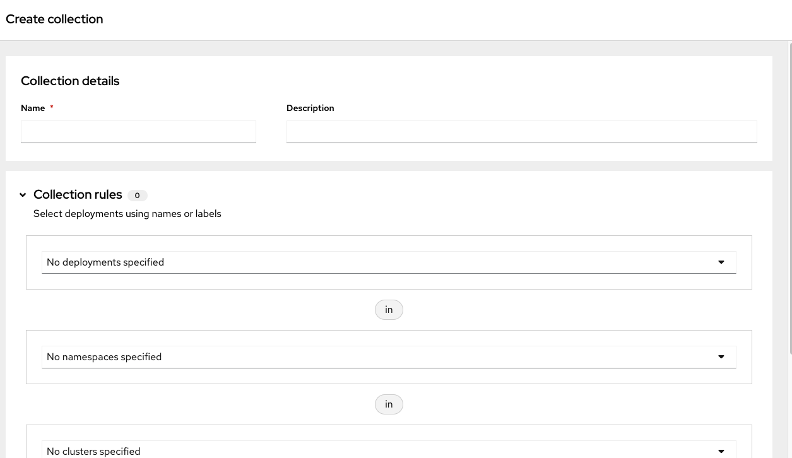

= Vulnerability Management

== Module goals

* Understand reports in the Vulnerability Management Dashboard
* Set and manage risk acceptance workflows 
* Create a simple report to email to stakeholders

== Introduction to vulnerability management in RHACS

You start with the topic of vulnerability management because it is familiar to most security teams, even those without prior experience with containers or Kubernetes. The vulnerability management process helps protect the software supply chain and prevent known vulnerabilities from being used as an entry point into your applications.

In this lab, you explore the vulnerability management features of Red Hat^(R)^ Advanced Cluster Security.

The overview provides several important reports - where the vulnerabilities are, which are the most widespread or the most recent, where my container images are coming from, and important vulnerabilities in OpenShift itself.

More important than fixing any one vulnerability is establishing a process to keep container images updated and to prevent the promotion through the pipeline for images that have serious, fixable vulnerabilities.

=== Definition review

You will see a lot of the following scores throughout the next sections. It's important that you understand the pros and cons of how vulnerabilites are scored, ranked and triaged.

==== CVE

A Common Vulnerabilities and Exposures (CVE) is a publicly disclosed cybersecurity vulnerability or exposure. The concept of CVEs was introduced to provide a standardized method for identifying and cataloging security vulnerabilities in software and hardware. Each CVE is assigned a unique identifier, such as "CVE-2024-1234," which helps in clearly distinguishing one vulnerability from another.

Here are the key components of a CVE:

- CVE Identifier (CVE ID): A unique identifier assigned to a vulnerability, in the format "CVE-YYYY-NNNN", where "YYYY" represents the year the CVE was issued, and "NNNN" is a sequence number.
- Description: A brief and precise description of the vulnerability, including details about the nature of the issue, the affected products, and the potential impact.
- References: Links to additional information about the vulnerability, such as advisories, technical documentation, and other relevant resources. These references help users understand the context and implications of the vulnerability.
- Date Entry Created: The date when the CVE entry was created, which helps track the timeline of when the vulnerability was identified and disclosed.
- Status: Indicates whether the CVE entry is in a draft state, has been published, or has been modified. This helps users know the current state of the CVE information.
- CVSS Score (optional but common): The Common Vulnerability Scoring System (CVSS) score provides a standardized way to measure the severity of the vulnerability. The score is typically represented as a number between 0 and 10, with higher scores indicating more severe vulnerabilities.
- CWE ID (optional but common): The Common Weakness Enumeration (CWE) identifier categorizes the type of vulnerability. For instance, a CWE ID can indicate if the issue is a buffer overflow, SQL injection, etc.
- Acknowledgments (optional): Recognition of individuals or organizations that reported or discovered the vulnerability.

Find out more at the link:https://www.cve.org/[MITRE website^].

==== CVSS

The Common Vulnerability Scoring System (CVSS) is an open framework for communicating the characteristics and severity of software vulnerabilities.

They consist of a the following:

*Base Metrics*:These metrics capture the characteristics of a vulnerability that are constant over time and across user environments.
*Temporal Metrics:* These metrics measure the characteristics of a vulnerability that change over time but not across user environments. 
*Environmental Metrics*: These metrics measure the characteristics of a vulnerability that are unique to a user's environment. 

The CVSS score is computed using a formula that combines these metrics, giving more weight to the base metrics. Temporal and environmental metrics adjust the base score to reflect the current threat landscape and specific user environment considerations. The resulting scores are categorized as:

* Low (0.1 - 3.9)
* Medium (4.0 - 6.9)
* High (7.0 - 8.9)
* Critical (9.0 - 10.0)

The structured approach of CVSS allows organizations to assess the risk of vulnerabilities consistently and to make informed decisions regarding vulnerability management and remediation prioritization. However, it does have its drawbacks such as a Lack of context sensitivity, static nature, and a potential for misinterpretation to name a few.

Find out more at the link:https://nvd.nist.gov/vuln-metrics/cvss[NIST website^].

==== Red Hat Security Advisory (RHSA)

The RHSA stands for Red Hat Security Advisory. It is a notification issued by Red Hat, a leading provider of enterprise open-source solutions, to inform users about security vulnerabilities and the corresponding updates or patches available to mitigate these risks.

Key components of RHSA:

* Advisory ID: A unique identifier for the advisory, typically including the year and a sequential number (e.g., RHSA-2024:1234).
* Description: A summary of the vulnerability, including affected components and potential impacts.
* Severity: The criticality of the vulnerability, often classified as Low, Moderate, Important, or Critical.
* Affected Products: A list of Red Hat products and versions impacted by the vulnerability.
* Resolution: Information about the patch or update that resolves the issue, including links to download the necessary updates.
* References: Additional resources such as CVE (Common Vulnerabilities and Exposures) identifiers and links to detailed reports.

Find out more at the link: https://access.redhat.com/articles/explaining_redhat_errata[Red Hat  website^]

=== The Vulnerability Management (1.0) dashboard

Let us continue by looking at our primary use case for RHACS that is the Vulnerability Management features and dashboard, a familiar topic for most security teams.

IMPORTANT: The locations and size of your panels may vary depending on your screen size and zoom.

NOTE: For the following section, please note that the order in which the images appear or the number of components affected may vary depending on versions and other applications running in the cluster.

. Click the *Vulnerability Management (1.0)* tab, and then select *Dashboard*

Buttons along the top of the interface will list details by;

- CVEs
- Node vulnerabilities
- Image vulnerabilities and risk

The *Application & Infrastructure* button displays a list that takes you to reports by;

- Clusters
- Namespace
- Deployment
- Node Component
- Image Component

Also, note the *Filter CVES* buttons that limit the reports to only *Fixable* CVEs or *ALL* CVEs.

image::acs-vuln-dashboard-00.png[link=self, window=blank, width=100%, Vulnerability Management Dashboard]

The dashboard opetions provides several critical vulnerability breakdowns, such as:

- Top risky deployments/images
- Recently detected image vulnerabilities
- Most common image vulnerabilities

More important than fixing any vulnerability is establishing a process to keep container images updated and to prevent the promotion through the pipeline for images with serious, fixable vulnerabilities. RHACS displays this through the *Top Risky Deployments by CVE and CVSS Score* and takes the container’s configuration and vulnerability details to show you the most *at risk* deployments in your cluster.

image::acs-vuln-dashboard-01.png[link=self, window=blank, width=100%, Riskiest Deployments]

[start=2]

. Above the panel information, there are buttons to link you to all policies, CVEs, and images, and a menu to bring you to reports by cluster, namespace, deployment, and component. The vulnerability dashboard can be filtered by clicking the *Fixable CVSS score* button.

image::acs-vuln-dashboard-02.png[link=self, window=blank, width=100%, Top Policy Buttons]

[start=3]

. Locate the *Top riskiest images* panel. 

Here, you can see the CVEs associated with containers currently running in the cluster.

image::acs-risk-02.png[link=self, window=blank, width=100%, Riskiest Images]

[start=4]

. In the *Top Riskiest Images* panel, click on the *VIEW ALL* button.

image::acs-risk-03.png[link=self, window=blank, width=100%, Riskiest Images]

The images in this dashboard are listed here in order of *risk*, 

Risk is based on a multitude of security issues, such as

- the severity of the vulnerabilities present
- in the components in the images
- vulnerability impact
- the image is active

image::acs-risk-04.png[link=self, window=blank, width=100%]

Notice which images are more exposed. Not only can we see the number of CVEs affecting the images, but which of them are fixable? We can also see:

- Creation date
- Scan time
- Image OS
- Image status
- How many deployments are using the vulnerable image
- The total components in the image

[start=5]

. Next, find and click on the image *ctf-web-to-system:latest-v2*. You will review the images' components and violations.

image::acs-risk-05.png[link=self, window=blank, width=100%, Visa Processor Image]

NOTE: If you cannot find the ctf-web-to-system:latest-v2 image, use the search bar to filter for the specific image you want. Try searching by *deployment* And then entering *ctf-web-to-system*

image::acs-risk-06.png[link=self, window=blank, width=100%, Search Bar]

You can move on to the next section only when the dashboard displays the image below.

image::acs-risk-07.png[link=self, window=blank, width=100%, Image Info]

=== RHACS Vulnerability Scanner

RHACS' Scanner v4 is a built-in vulnerability scanner that breaks down images into layers and components - where components can be operating-system installed packages or dependencies installed by programming languages like Python, Javascript, Go, Java and more. The *Image Summary tab* provides the essential security details of the image overall, with links to the components. Below, you can see why the image is ranked as a critically vulnerable application:

- In the *Details and metadata* → Image Summary panel, the information you see there tells you that this image has a severe security problem - the base image was imported several years ago (Debian 9).
- At the top of the page is the warning that CVE data is stale - that this image has a base OS version whose distribution has stopped providing security information and likely stopped publishing security fixes. ACS will still scan for language issues even if the Operating System does not have CVE dat available.

.Procedure
. Scroll down the page to the *Image Findings* section.

Here you find the details of the image vulnerabilities. There are 82 vulnerabilities detected with 80 of those vulnerabilities listed as fixable (at the time of the creation of this workshop.)

image::acs-vulns-00.png[link=self, window=blank, width=100%, Fixable Vulnerabilities]

[start=2]

. Above the *Image Findings* section, click on the *Dockerfile* tab:

image::acs-vulns-01.png[link=self, window=blank, width=100%, Dockerfile View]

The Dockerfile tab view shows the layer-by-layer view, and, as you can see, the most recent layers are also several years old. Time is not kind to images and components - as vulnerabilities are discovered, RHACS will display newly discovered CVEs. The layers that are listed as *Source=OS* are not showing CVE data since the CVE feeds are stale or do not have an information. However, the Python libraries that are added to the container are showing vulnerabilities. For example the 'mercurial' package in the 4 layer.

image::acs-vulns-02.png[link=self, window=blank, width=100%]

=== The Vulnerability Management (2.0) dashboard

The Vulnerability Management 2.0 dashboard is part of a more extensive overhaul of vulnerability management in RHACS. Vulnerability management 2.0 is focused on the categorizing vulnerabilities by workload so that we can scan RHEL CoreOS and node-level scanning and correlate it with platform and application vulnerabilities. This is because security teams want to understand at what software layer of vulnerability resides so they know what team it can reach out to to resolve a fix. 

Let's start off this section by reviewing a similar use case in the Vulnerability Management 2.0 dashboard.

image::02-vuln2-1.png[link=self, window=blank, width=100%]

Another dashboard aims to show the same information as the vulnerability management 1.0 dashboard, but in a more scalable and systematic approach, you can see on the top left that the vulnerabilities are categorized by CVE, Image and Deployment.

In the UI, you will see thousands of vulnerabilities, over 200 images and over 300 deployments. This is because multiple images are being used across different deployments

NOTE: The numbers may be different in your environments. 

image::02-vuln2-2.png[link=self, window=blank, width=100%]

Let's find our vulnerable Java application and do some dissecting

.Procedure
. Click the drop down and select deployment

image::02-vuln2-3.png[link=self, window=blank, width=100%]

[start=2]
. Then filter for the *ctf-web-to-system* image

image::02-vuln2-4.png[link=self, window=blank, width=100%]

You will get the same information from the previous section. 

image::02-vuln2-5.png[link=self, window=blank, width=100%]

However, if you click the deployments tab, you will see the specific deployments with all these vulnerabilities this ability to see the individual deployments as well as their images is crucial when you're talking about multiple clusters and thousands of vulnerabilities you're going to have the same workloads across different clusters and you will need to drill down into the individual deployments

[start=3]
. Click on the CVE severity tab on the left and filer by critical and important vulnerabilities.

image::02-vuln2-6.png[link=self, window=blank, width=100%]

You should see that all of the critical and important vulnerabilities are fixable. This is mostly due to the age of the container image and its contents.

IMPORTANT: Container OS age and the age of its components are a massive correlating factor to the number of vulnerabilites present. Speed is security when it comes to containers. 

Now if you care about a specific vulnerability it is extremely useful to be able to see all of the components affected by that vulnerability. 

[start=4]
. Go back to the VM 2.0 dasboard and search for the log4shell CVE (CVE-2021-44228)

image::02-vuln2-7.png[link=self, window=blank, width=100%]

NOTE: Make sure to select *CVE* in the dropdown.

[start=5]
. Click on the CVE
. Scroll down and look at the impact of the CVE.

image::02-vuln2-6.png[link=self, window=blank, width=100%]

There are two deployments and two images impacted. 

[Important]
====
This is a glaringly obvious example of a critical vulnerability, take a moment to think about how your team would triage this.
====

We will move onto vulnerability reporting workflow but take some time to think about how you and your teams would handle a situation such as log4shell.

=== Vulnerability reporting

Internal vulnerability reporting significantly enhances software security and quality by allowing development teams to address issues early, reducing the risk of breaches and failures. This proactive approach fosters a security-aware culture and encourages best practices. Efficient reporting channels also enable teams to prioritize and promptly fix critical vulnerabilities, leading to a more robust and reliable product, which boosts user trust and satisfaction.

In this next session, we will draft up a vulnerability report around the log for Shell vulnerability, making sure that it never gets deployed into our cluster in the future

.Goals

* Create a collection that targets the log4shell CVE (CVE-2021-44228)
* Ensure that any detection of this vulnerability will trigger a report to the designated user. 

.Procedure

. Let's start by clicking on the *Vulnerability Reporting* tab 

image::02-vr-1.png[link=self, window=blank, width=100%]

[start=2]
. Click the *Create report* button.

image::02-vr-2.png[link=self, window=blank, width=100%]

You will see that creating a report is a 3 step process. It requires you to configure the report parameters and the delivery destination, and then you have to review and create your report.

The configurable parameters are the following:

- Report Name
- Report Description
- CVE severity
- CVE status
- Image type
- CVEs discovered since (with a date)
- And a Report scope.

[start=3]
. Go ahead and fill out the information. 

NOTE: The collection scope is where you are going to target the two images with the vulnerability.

image::02-vr-3.png[link=self, window=blank, width=100%]

[start=5]
. When you are done, select the *Select a collection* dropdown
. Click *Create Collection*

You can create collection rules by deployment, namespace and cluster. The collections are setup this way so that you can easily attach policies, vulnerability reports and notifications by the logical groupings of your organization. 

Since we want to target only two deployments let's add the two to the Collection rules.

[start=7]
. Add the two deployments to the rules (frontend & sonarcube). and you should see the impacted deployments in the collection results on the right side of the UI.

image::02-vr-5.png[link=self, window=blank, width=100%]

[start=8]
. Review the collection
. Hit *Save*
. Click *Next* once you are back in the *Configure report parameters* tab
. Next create an email notifier that will send YOU and email every Monday to remind you about the vulnerabilites in these two deployments.

image::02-vr-6.png[link=self, window=blank, width=100%]
image::02-vr-7.png[link=self, window=blank, width=100%]

NOTE: Don't worry if you dont want to enable the notification. The exersize is about going through the workflow. 

[start=12]
. Once you are happy with the destination select the *Email template* option. Using this option you can customize the report to say whatever you desire. Here is your chance to be cheeky :) 
. Select a frequency. For example, weekly on Monday.
. Hit *Next*
. Review your masterpiece and click *Create*

image::https://media1.giphy.com/media/v1.Y2lkPTc5MGI3NjExOWJ0ZWRjZ3g0OTUyOGE5MDVhdDgyZzVhczcwNGdpbWxibzBhejZzMyZlcD12MV9pbnRlcm5hbF9naWZfYnlfaWQmY3Q9Zw/VdiQKDAguhDSi37gn1/giphy.gif[itsalive]

Although you don't have to wait until Monday to view the report.

[start=15]
. Click the vertical ellipses on the right side of the UI and click *Generate Download*

NOTE: 
====
You may have to wait for the report to generate. Feel free to listen to elevator music during this time.
====

== What would you do?

It should be fairly clear that our notification selection and collection was not the most efficient way to target a single vulnerability.

Before the next module it would be great if you can think about how you would formation your notifications and collections? Would they be based around labels, or groups? Would you ensure that emails are in the Kubernetes and OpenShift deployment labels so that gorups are easy to contact?

Remember for sending these communications, you must consider the following questions:

* What schedule would have the most impact when communicating with stakeholders?
* Who is the audience?
* Should you include only specific severity vulnerabilities in your report?
* Should you include only fixable vulnerabilities in your report?

== Summary

Great job!!

In this lab, you learned how to interpret the reports in the Vulnerability Management Dashboard. Finally, you created a simple report to email to stakeholders. On to *Security Configuration Management*!!