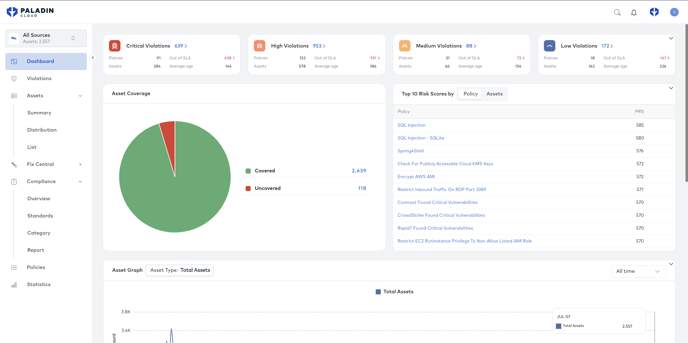
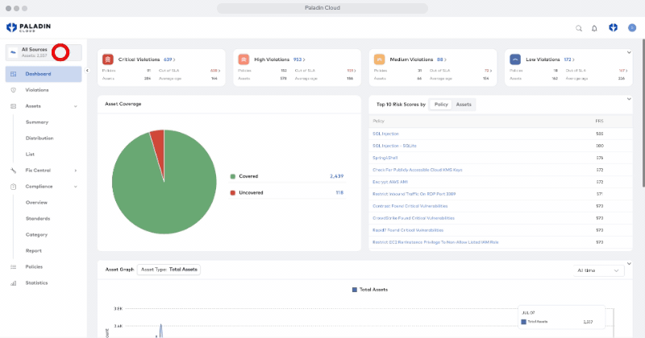
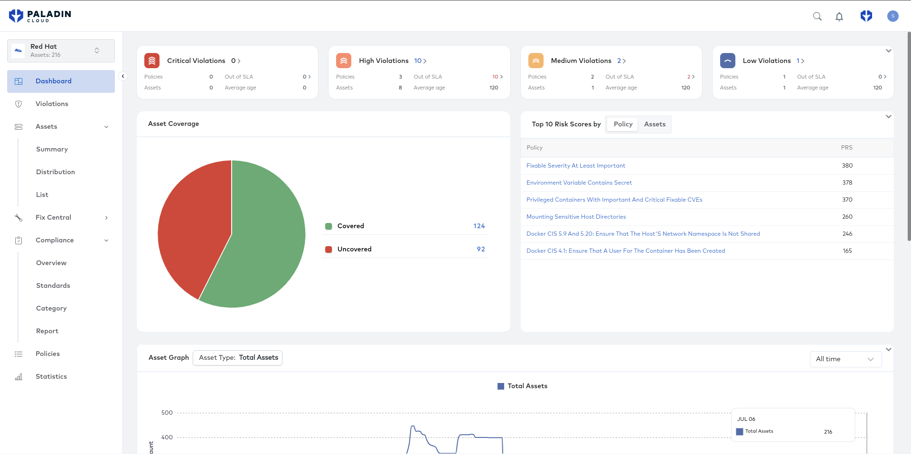
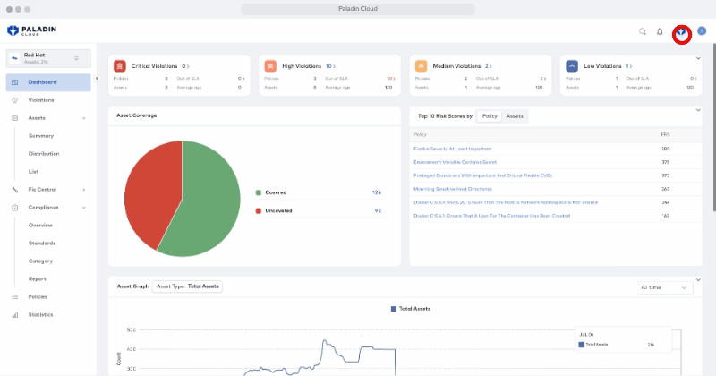
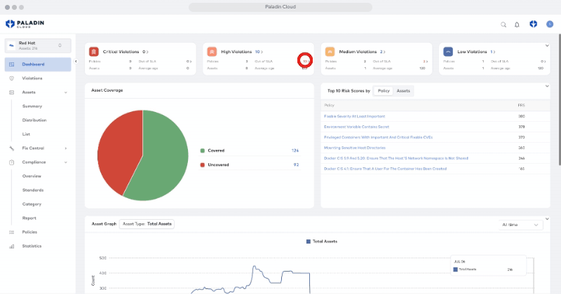

= Paladin Cloud Integration

== Module goals
.Goals
* Review the Paladin Cloud Dashboard
* Review the Paladin Cloud integration with Red Hat ACS

== Understanding the Paladin Cloud Dashboard

The main dashboard shows a variety of information pertaining to your clusters including a break down of violations. The violations are separated into Critical, High, Medium, and Low violations, with the quantity of each type of violation. 

The dashboard also shows the Asset Coverage, Top 10 Risk Scores by either Policy or Assets, as well as an Asset Graph. 

The information displayed on the dashboard is linked to the Asset Group selected. In the case of the screenshot above, the Asset Group is currently assigned as All Sources. 

To change the Asset Group, click on Assets and select the asset you wish to see. 

With the scope changed, we can see the information provided has changed to reflect that specific asset group. 

=== Out of SLA

Another piece of useful information is the Out of SLA number. This shows the number of violations that are outside of the Service Level Agreement timeframe. To see the SLA's, click on the Paladin icon and select SLA Information.

With the Out of SLA number, it becomes easy to find which violations should be adressed first. Clicking an Out of SLA number will take you to the violations page for open, out of SLA violagions of that severity. 

=== The Asset Graph

